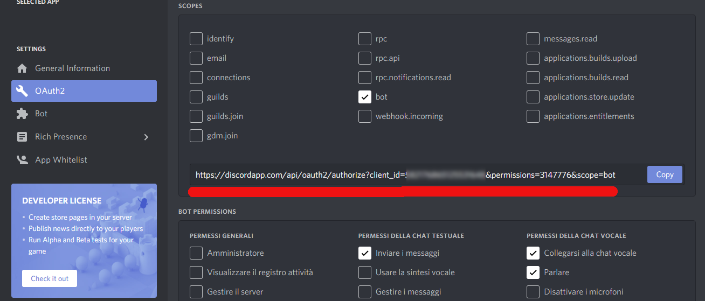

# Deploy your own Discord Bot to stream audio 

A template to easily deploy a Discord BOT to Heroku or on your local machine to stream audio without the need of external tools such as FFmpeg.

Currently it supports only ".ogg" files encoded with OPUS (You can easily convert your audio files to OPUS with "https://www.aconvert.com/audio/mp3-to-opus/")

## Heroku Deploy
## Requirements

* [GIT](https://git-scm.com/downloads)
* [Heroku Account](https://signup.heroku.com/)
* [Heroku CLI] (https://devcenter.heroku.com/articles/heroku-cli#download-and-install)

## Installation

1. Open a shell and Run `git clone https://github.com/AlessandroDeFrancesco/Nodejs-DiscordBot-template.git`
2. Run `heroku create`
3. Run `git push heroku master`
4. Run `heroku config:set DISCORD_BOT_TOKEN="{your_bot_token}"`
5. Run `heroku ps:scale web=1`

## Local Deploy
## Requirements

* [GIT](https://git-scm.com/downloads)
* [Node.js](http://nodejs.org/)
* [Discord](https://discordapp.com/developers/applications/)

## Installation

1. Go to "https://discordapp.com/developers/applications/"
2. Create a new Application
3. Go to Bot -> Add Bot 
3. Save the Token of the Bot
4. Open a shell and Run `git clone https://github.com/AlessandroDeFrancesco/Nodejs-DiscordBot-template.git`
5.1 On Linux Ubuntu Run `export DISCORD_BOT_TOKEN="{your_bot_token}"`
5.2 On Windows Powershell Run `$env:DISCORD_BOT_TOKEN="{your_bot_token}"`
6. Run `npm install`
7. Run `npm start`

## Invite the bot to your server

Once your bot is deployed you can invite your bot to your server with the link generated in "https://discordapp.com/developers/applications/" as in the image below:

Just make sure to give the right Scope and Permissions.

## Editing

If you want to add or remove audio files you can do so in the folder ./sounds/. Just remember that the files must be ".ogg" encoded with OPUS.
(You can easily convert your audio files to OPUS with "https://www.aconvert.com/audio/mp3-to-opus/")
